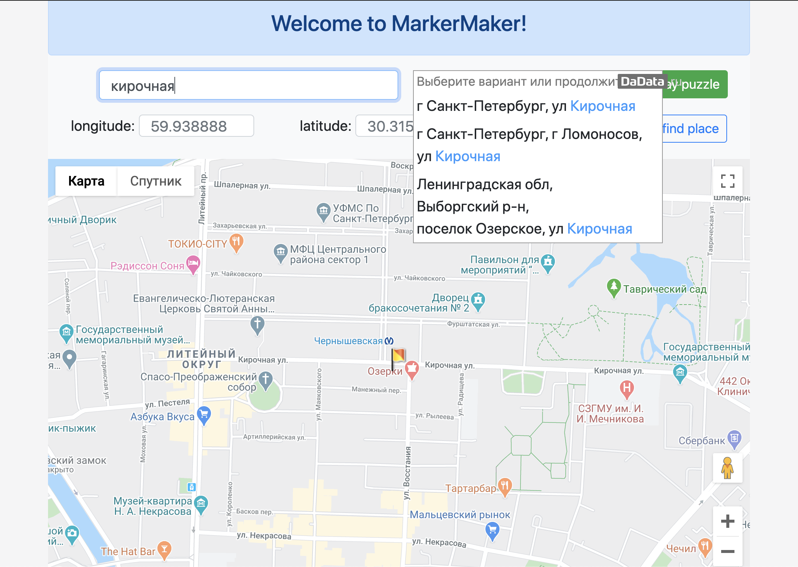

# <h2> Practice with public APIs </h2>

  

<h3> Technologies </h3>
<ul>
<li> Express</li>
<li> Hbs </li>
<li> Google Maps API</li>
<li> Dadata API</li>
<li> Dotenv</li>
</ul>

<h3> How to start </h3>
<ul>
<li> clone this repository </li>
<li> npm install</li>
<li> npm start </li>
</ul>
